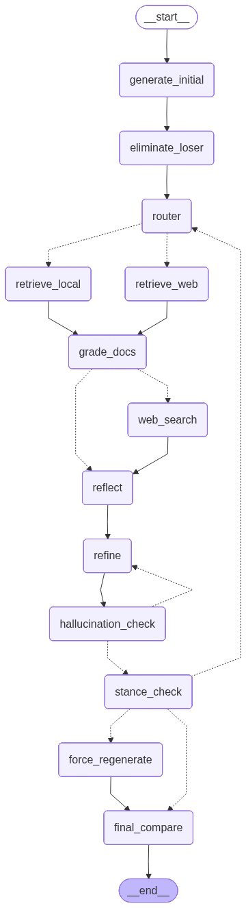

# Argument Quality Analysis

A research codebase that studies what makes an argument persuasive on Reddit's
r/changemyview (CMV), and then uses those signals to drive an agentic
refinement loop that improves a candidate argument against a given post.

The project has three parts:

1. **Preprocessing** — building a clean pair-wise dataset of delta-awarded vs.
   non-delta CMV arguments, plus an Israel-focused subset used as the
   retrieval corpus.
2. **Models** — baseline TF-IDF classifiers, a zero-shot GPT-5.4-nano
   pair-wise baseline, and a QLoRA fine-tuned Qwen3-8B pair-wise ranker.
3. **Agents** — a LangGraph workflow that refines two opposing arguments
   against each other using Adaptive-RAG, Self-RAG, Reflective-RAG, and
   Reflexion patterns, with the Qwen ranker as the reward signal.

## Repository layout

```
preprocessing/   # generic pair-wise data pipelines (Webis-CMV-20, winning-args-corpus)
rag/             # pro-Israel RAG-corpus pipeline (scrape -> classify -> ingest)
models/          # TF-IDF baselines + Qwen3-8B pair-wise ranker
agents/          # LangGraph refinement workflow + retrieval backends + generate entrypoint
webapp/          # Gradio web UI: paste a CMV post, get a rebuttal (see "Web app")
tests/           # offline graph-wiring, helper-unit, and import smoke tests
schemas.py       # Pydantic types shared across the pipelines
graph.png        # rendered topology of the agentic workflow (see "Agentic refinement")
data/            # generated artifacts (gitignored)
.chroma/         # Chroma vector store for the retriever (gitignored)
```

## Setup

This project uses [uv](https://github.com/astral-sh/uv) and requires Python
3.11+.

```bash
uv sync
```

Create a `.env` file at the repo root with whichever keys you need:

```
OPENAI_API_KEY=...
TAVILY_API_KEY=...          # optional, enables the web-search retrieval arm
HF_TOKEN=...                # optional, for dataset/model uploads
RANKER_PATH=...             # Qwen ranker checkpoint, for the agentic graph
```

### Observability (optional)

Both are opt-in and no-op unless the keys are present:

- **LangSmith** traces every node / LLM call of the agentic graph. Enable with
  `LANGSMITH_TRACING=true`, `LANGSMITH_API_KEY=ls__...`, and optionally
  `LANGSMITH_PROJECT=argument-quality`.
- **Weights & Biases** logs the Qwen QLoRA fine-tuning run. Enable with
  `WANDB_API_KEY=...` (and optionally `WANDB_PROJECT=qwen-qlora-ranker`) before
  running `uv run python -m models.qwen`.

### Tests

The `tests/` suite is fully offline — no API keys, network, or model loading
(every LLM / retrieval / Qwen boundary is stubbed). Run it with:

```bash
uv run pytest
```

It covers the graph's loop caps and termination (`test_graph_offline.py`), the
deterministic string/parse helpers (`test_helpers.py`), and the package layout /
shared entrypoint (`test_layout_imports.py`).

## Data pipeline

The preprocessing pipeline produces a unified pair-wise argument quality
dataset from two sources:

- [Webis-CMV-20](https://webis.de/data/webis-cmv-20.html)
- winning-args-corpus (Tan et al., 2016)

```bash
uv run python -m preprocessing.preprocess
```

A semantic-similarity filter then removes off-topic and near-duplicate pairs.
OpenAI embeddings give three cosine similarities per row
(post↔delta, post↔nodelta, delta↔nodelta); thresholds keep only rows where
both arguments are on-topic with respect to the original post and the two arguments
are not near-duplicates of each other.

```bash
uv run python -m preprocessing.filter_by_similarity
```

For the Israel-focused RAG corpus, the `rag/` package scrapes CMV threads via
arctic-shift, classifies each argument's stance, and ingests the high-confidence
pro-Israel arguments (plus a few legal primary sources) into Chroma:

```bash
uv run python -m rag.scrape_cmv_israel      # -> data/cmv_israel_rag.parquet
uv run python -m rag.classify_stance        # -> data/cmv_israel_rag_pro.parquet
uv run python -m rag.ingest_rag             # -> .chroma/ pro_israel_corpus
uv run python -m rag.ingest_legal_sources   # -> Palmer/San Remo legal chunks
```

## Baselines

Run TF-IDF + Logistic Regression / Random Forest / XGBoost over the pair-wise
dataset:

```bash
uv run python -m models.main
```

## GPT-5.4-nano zero-shot baseline

Zero-shot pair-wise prompting of GPT-5.4-nano (no fine-tuning). Both
arguments are shown in a single prompt; the model picks `A` or `B`, and the
probability of `A` is calibrated from the top-logprob distribution at the
answer token.

```bash
uv run python -m models.gpt_5_4_nano
```

## Qwen3-8B pair-wise ranker

QLoRA (4-bit NF4) fine-tuning of Qwen3-8B with a margin ranking loss over
delta vs. non-delta arguments. Scoring is order-invariant — each argument
gets an independent forward pass and the higher score wins.

```bash
uv run python -m models.qwen
```

## Agentic refinement

The `agents` package wires a LangGraph workflow that drafts two candidate
arguments, eliminates the weaker one up front on the Qwen ranker, then refines
the survivor against retrieved evidence. Refinement is governed by two
independent loops, each with its own cap:

- **Grounding loop** (`hallucination_check -> refine`): re-refines while the
  draft is ungrounded, up to `MAX_GROUND_RETRIES` times **per outer pass**
  (reset by the router each pass).
- **Outer / stance loop** (`stance_check -> router`): if the draft is not a
  clearly pro-Israel reply, it reroutes for another refinement pass, up to
  `MAX_OUTER_ITERS` passes; once the cap is hit, `force_regenerate` does one
  last targeted pro-Israel rewrite.

Worst case is therefore `MAX_OUTER_ITERS x MAX_GROUND_RETRIES` grounding
refines (3 x 2 = 6).

Four patterns are fused into the graph:

- **Adaptive RAG** — the router picks between local Chroma and Tavily web
  search each pass.
- **Self-RAG** — two layers: `grade_docs` gives a binary relevance verdict
  (and triggers a web search if the local docs are irrelevant), and
  `hallucination_check` verifies the refined draft is grounded in the evidence.
- **Reflective RAG** — `reflect` grounds the critique in retrieved evidence.
- **Reflexion** — every critique is accumulated into a running
  `critique_history` that the refiner consumes in full, so it stops repeating
  fixed mistakes; the Qwen ranker supplies the one-time A-vs-B reward.

### Graph nodes

- **generate_initial** — drafts the two initial candidate arguments (`arg_a`,
  `arg_b`) from the topic and original post.
- **eliminate_loser** — runs one Qwen pairwise comparison on the two raw
  initial drafts, keeps the winner as the active side, and marks the loser
  converged so only the survivor iterates from here. This is the only A-vs-B
  decision in the graph, made when both drafts are at equal polish.
- **router** — Adaptive-RAG: picks `local` or `web` for the active side this
  pass; when it picks `web`, the same call also plans the search queries that
  target the critique's evidence gaps. It also resets the grounding-retry
  budget and clears any stale grounding verdict at the start of each pass. (Set
  `FORCE_RETRIEVAL_MODE={local|web}` in the env to pin the route for debugging.)
- **retrieve_local** — queries the Chroma `pro_israel_corpus` (delta-awarded
  CMV-Israel arguments) using the topic + post as the query.
- **retrieve_web** — runs the router's planned queries through Tavily,
  restricted to a curated domain allow-list (`WEB_ALLOWED_DOMAINS`).
- **grade_docs** — Self-RAG binary relevance verdict. If the docs are relevant
  they feed `reflect`; if not, they are dropped and `web_search=True` routes to
  the web-search fallback first.
- **web_search** — fallback triggered by an irrelevant grade: runs a Tavily
  search (planning queries from the critique if the router didn't) and fills
  the citation pool with web results before reflecting.
- **reflect** — generates a critique of the current draft grounded in the
  retrieved evidence, comparing it against the original post (what's missing /
  superfluous). Each critique is appended to `critique_history` (Reflexion).
- **refine** — rewrites the active side's draft using the full critique history
  plus any **fix notes** (ungrounded-claim issues from `hallucination_check`
  and/or a stance reason from `stance_check`), attaching inline `[n]` citations
  to evidence-backed claims. Drops an empty `### Sources` footer if the model
  cited nothing.
- **hallucination_check** — Self-RAG binary groundedness check. Skipped when
  retrieval was `local` (those chunks are example arguments, not factual
  sources). Otherwise grades the draft; only a genuinely fabricated fact counts
  as ungrounded (citation-marker problems are tolerated). An ungrounded verdict
  spends one grounding retry and loops back to `refine` until the per-pass
  budget is spent.
- **stance_check** — verifies the draft is a clearly pro-Israel reply. On
  failure it opens a new outer pass (records a `regen_reason` that the next
  refine must fix) and reroutes to the router, or — once `MAX_OUTER_ITERS` is
  hit — routes to `force_regenerate`.
- **force_regenerate** — last-resort forced pro-Israel rewrite when the stance
  check keeps failing at the outer cap, guaranteeing a pro-Israel output.
- **final_compare** — declares the surviving side the winner, publishes the
  result as `generation`, surfaces any grounded / pro-Israel warnings, and
  prints the run's trajectory.

Run end-to-end:

```bash
uv run python -m agents.graph.builder \
  --topic "CMV: ..." \
  --post  "The original post body..."
```

Graph topology:



## Web app

A Gradio UI for trying the workflow interactively, without Reddit: paste a CMV
**topic** and the **anti-Israel post body**, and it returns the generated
rebuttal plus its grounded / pro-Israel status. It reuses the same
`agents.generate.generate_pro_israel_response` entrypoint as the
`agents.graph.builder` CLI, so both run identical generation logic.

```bash
uv run python -m webapp.app
```

Then open the local URL Gradio prints. A full run loads the Qwen ranker and
makes several LLM + web-search calls, so expect tens of seconds to a couple of
minutes per request. Needs `OPENAI_API_KEY`, `TAVILY_API_KEY`, `RANKER_PATH`,
and `HF_TOKEN` in `.env`.
