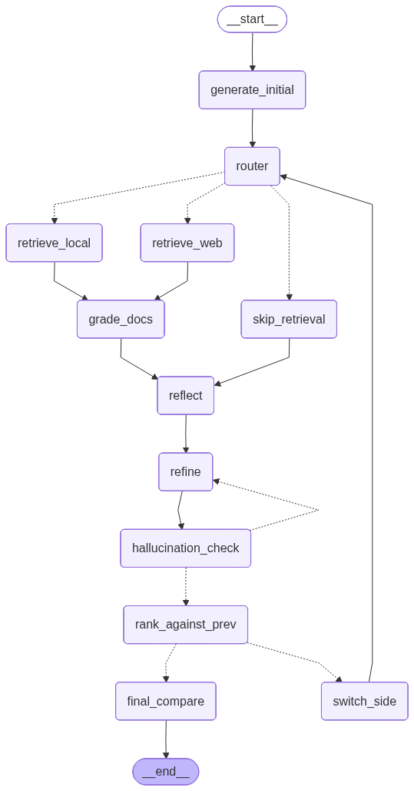

# Argument Quality Analysis

A research codebase that studies what makes an argument persuasive on Reddit's
r/changemyview (CMV), and then uses those signals to drive an agentic
refinement loop that improves a candidate argument against a given post.

The project has three parts:

1. **Preprocessing** — building a clean pair-wise dataset of delta-awarded vs.
   non-delta CMV arguments, plus an Israel-focused subset used as the
   retrieval corpus.
2. **Models** — baseline TF-IDF classifiers, a zero-shot GPT-5.4-nano
   pair-wise baseline, and a QLoRA fine-tuned Qwen3-8B pair-wise ranker.
3. **Agents** — a LangGraph workflow that refines two opposing arguments
   against each other using Adaptive-RAG, Self-RAG, Reflective-RAG, and
   Reflexion patterns, with the Qwen ranker as the reward signal.

## Repository layout

```
preprocessing/   # data pipelines (Webis-CMV-20, winning-args-corpus, CMV-Israel)
models/          # TF-IDF baselines + Qwen3-8B pair-wise ranker
agents/          # LangGraph refinement workflow + retrieval backends
schemas.py       # Pydantic types shared across the pipelines
docs/            # Local document store for the retriever
data/            # Generated artifacts (gitignored)
```

## Setup

This project uses [uv](https://github.com/astral-sh/uv) and requires Python
3.11+.

```bash
uv sync
```

Create a `.env` file at the repo root with whichever keys you need:

```
OPENAI_API_KEY=...
TAVILY_API_KEY=...          # optional, enables the web-search retrieval arm
HF_TOKEN=...                # optional, for dataset/model uploads
```

## Data pipeline

The preprocessing pipeline produces a unified pair-wise argument quality
dataset from two sources:

- [Webis-CMV-20](https://webis.de/data/webis-cmv-20.html)
- winning-args-corpus (Tan et al., 2016)

```bash
python -m preprocessing.preprocess
```

A semantic-similarity filter then removes off-topic and near-duplicate pairs.
OpenAI embeddings give three cosine similarities per row
(post↔delta, post↔nodelta, delta↔nodelta); thresholds keep only rows where
both arguments are on-topic with respect to the original post and the two arguments
are not near-duplicates of each other.

```bash
python -m preprocessing.filter_by_similarity
```

For the Israel-focused RAG corpus, scrape CMV threads via arctic-shift and
ingest the delta-awarded pro-Israel arguments into Chroma:

```bash
python -m preprocessing.scrape_cmv_israel
python -m preprocessing.classify_stance
python -m preprocessing.ingest_rag
```

## Baselines

Run TF-IDF + Logistic Regression / Random Forest / XGBoost over the pair-wise
dataset:

```bash
python -m models.main
```

Results are appended to `results.csv`.

## GPT-5.4-nano zero-shot baseline

Zero-shot pair-wise prompting of GPT-5.4-nano (no fine-tuning). Both
arguments are shown in a single prompt; the model picks `A` or `B`, and the
probability of `A` is calibrated from the top-logprob distribution at the
answer token.

```bash
python -m models.gpt_5_4_nano
```

## Qwen3-8B pair-wise ranker

QLoRA (4-bit NF4) fine-tuning of Qwen3-8B with a margin ranking loss over
delta vs. non-delta arguments. Scoring is order-invariant — each argument
gets an independent forward pass and the higher score wins.

```bash
python -m models.qwen
```

## Agentic refinement

The `agents` package wires a LangGraph workflow that alternates between two
candidate arguments, refining each one against retrieved evidence until
neither improves on the Qwen ranker (or `MAX_ITERS` is hit).

Four patterns are fused into the graph:

- **Adaptive RAG** — the router picks between local Chroma, Tavily web
  search, or no retrieval each iteration.
- **Self-RAG** — `grade_docs` filters retrieved chunks for relevance.
- **Reflective RAG** — `reflect` grounds the critique in retrieved evidence.
- **Reflexion** — the verbal critique persists across iterations; the Qwen
  ranker supplies the scalar reward that decides keep-or-revert.

Run end-to-end:

```bash
python -m agents.graph.builder \
  --topic "CMV: ..." \
  --post  "The original post body..."
```

Graph topology:


